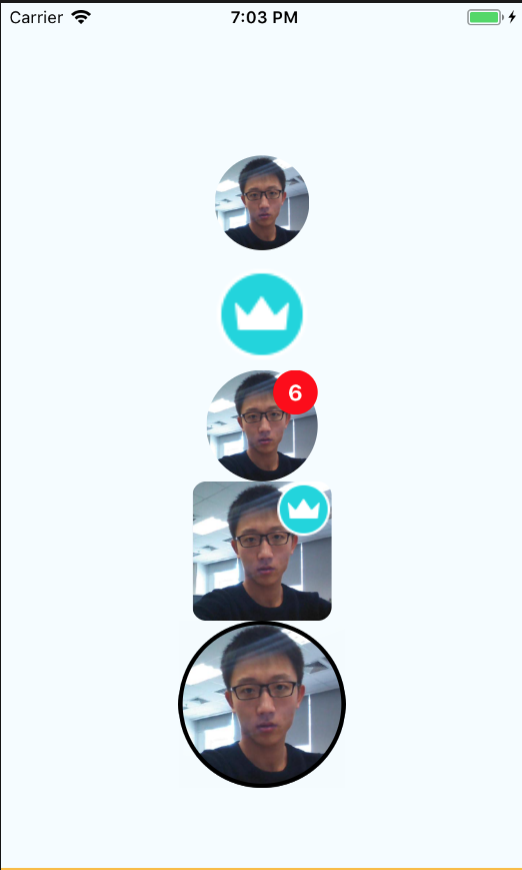

# React Native Badge Avatar

[](https://www.npmjs.com/package/react-native-badge-avatar)
[](https://www.npmjs.com/package/react-native-badge-avatar)

A user avatar display with support:
* name as Avatar
* url as Avatar
* Avatar border
* Avatar border color
* Avatar radius
* Badge Number
* Badge Icon
* Auto Badge Size & Position

Based on: https://github.com/Samoy/react-native-badge-view, https://github.com/avishayil/react-native-user-avatar

## ScreenShot


## Installation

`npm install --save react-native-badge-avatar` or `yarn add react-native-badge-avatar`

## Usage

```js
        <Avatar
          size="68"
          name="Dean Guo"
        />

        <Avatar
          size="80"
          name="Dean Guo"
          url="https://avatars3.githubusercontent.com/u/8385255?s=460&v=4"
          badge="6"
        />

        <Avatar
          size="100"
          name="Dean Guo"
          radius={0.2}
          url="https://avatars3.githubusercontent.com/u/8385255?s=460&v=4"
          badge="6"
          badgeIcon={require('./images/badge_icon.png')}
        />

        <Avatar
          size="120"
          borderColor="black"
          borderWidth={3}
          name="Dean Guo"
          url="https://avatars3.githubusercontent.com/u/8385255?s=460&v=4"
        />
```

## Prop
|Prop|Type|Required|Default|Comment|
|:----:|:---:|:---:|:---:|:----:|
|name|string|required|""|if no url will show name as Avatar|
|url|string|optional|""|Avatar Image url|
|size|string|optional|"48"|Size of Avatar, badge will be 1/4 of Avatar size|
|radius|int|optional|1| range of 0-1, 0 is rect, 1 is full circular|
|borderColor|string|optional|""|avatar border color|
|borderWidth|int|optional|0|avatar border width|
|badge|string|optional|""|badge number|
|badgeIcon|string|optional|""|badge icon url|
|badgeTextColor|string|optional|white|badge text color|
|badgeBackgroundColor|string|optional|red|badge backgroud color|

